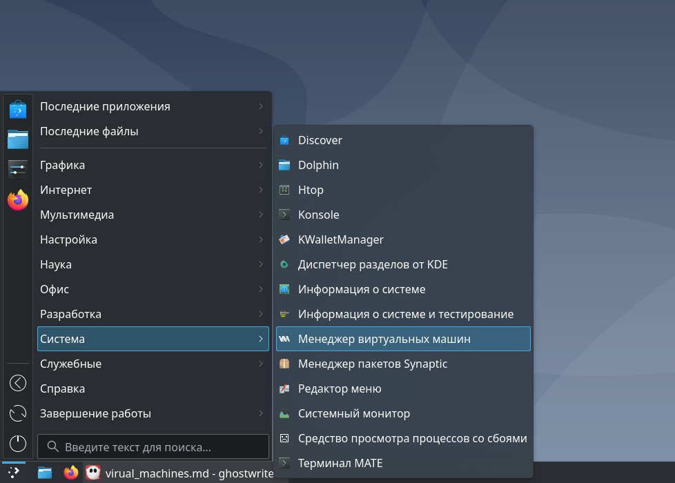
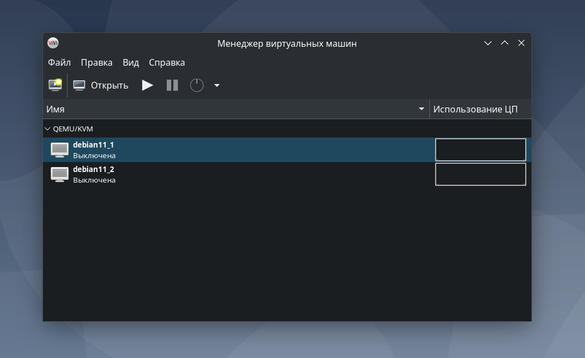

## Виртуальные машины на Debian с использованием ПО из apt

---

Аналогом программ **VirtualBox** и **VMware** в **apt** является **virt-manager**. Данная программа предоставляет графический интерфейс для управления виртуальными машинами, который схож с интерфейсом **VirtualBox** и **VMware**.
<br>  

### 1) Проверка доступности пакета virt-manager
Для проверки доступности пакета **virt-manager** в **apt** можно использовать команду:

```sh
apt policy virt-manager

#------------------------- Примерный вывод команды -----------------------#
kirillzalomov@debian:~$ apt policy virt-manager
virt-manager:
  Установлен: (отсутствует)
  Кандидат:   1:4.1.0-2
  Таблица версий:
 *** 1:4.1.0-2 500
        500 http://deb.debian.org/debian bookworm/main amd64 Packages
        500 http://deb.debian.org/debian bookworm/main i386 Packages
        100 /var/lib/dpkg/status
```

Если пакет будет не доступен, то вывод команды будет примерно таким:

```sh
kirillzalomov@debian:~$ apt policy virtualbox
virtualbox:
  Установлен: (отсутствует)
  Кандидат:   (отсутствует)
  Таблица версий:
```

Или таким:

```sh
kirillzalomov@debian:~$ apt policy vmware
N: Невозможно найти пакет vmware
```

### 2) Установка virt-manager

Для установки можно использовать команду:

```sh
sudo apt install virt-manager -y
```

После установки программа будет доступна в категории "Система - Менеджер виртуальных машин" (рисунок 1).


Рисунок 1 - Расположение программы virt-manager  
<br>  

Интерфейс программы **virt-manager** похож на интерфейсы программ **VirtualBox** и **VMware** (рисунок 2).


Рисунок 2 - Графический интерфейс программы virt-manager  
<br>  

<br>  
<br>  