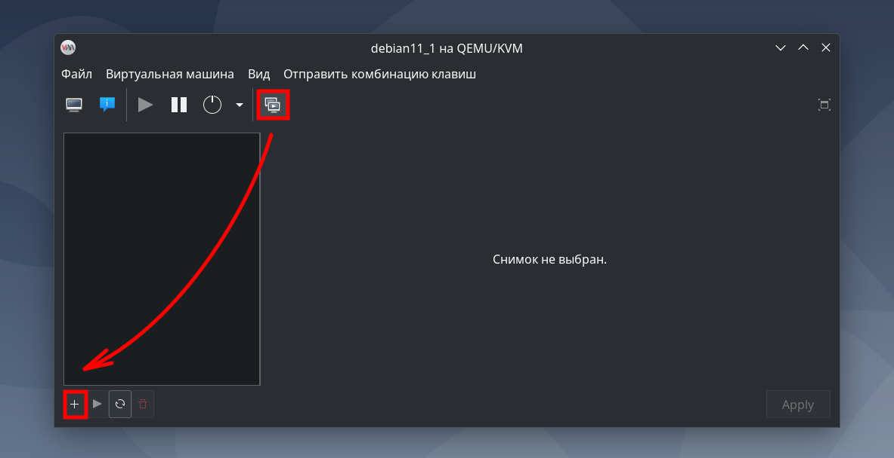

## Развёртывание сервера статического анализатора SonarQube  

---  

<br>  

## Оглавление

1. [Цели и задачи](#сhapter_1)  
2. [Выбор проекта на Java с открытым исходным кодом для тестирования работы статического анализатора SonarQube](#сhapter_2)  
3. [Установка и сборка выбранного проекта](#сhapter_3)  
  3.1. [Установка OpenJDK 21](#сhapter_3.1)  
  3.2. [Установка Maven](#сhapter_3.2)  
  3.3. [Сборка программы Pixelitor](#сhapter_3.3)  
  3.3. [Запуск программы Pixelitor](#сhapter_3.4)  
4. [Поиск официальных источников информации о SonarQube, документации и инструкции по развёртыванию](#сhapter_4)  
5. [Изучение системных требований SonarQube Community Build](#сhapter_5)  
6. [Подготовка виртуальных машин для установки SonarQube Community Build и дополнительных компонентов программной инфраструктуры](#сhapter_6)  
  6.1. [Настройка виртуальной машины для СУБД PostreSQL](#сhapter_6.1)  
  6.2. [Настройка виртуальной машины для сервера SonarQube Community Build](#сhapter_6.2)  


<br>  
<br>  

---  

<a name="сhapter_1"></a>
### 1) Определение целей и задач статьи  

- Выбрать проект с открытым исходным кодом на Java для тестирования работы статического анализатора SonarQube.
- Выполнить настройку среды и провести сборку выбранного проекта.
- Найти официальные источники информации по SonarQube.
- Изучить системные требования для установки SonarQube Community Build.
- Исходя из изученных системных требований, подготовить виртуальные машины для развёртывания сервера SonarQube Community Build.
- Установить SonarQube Community Build на виртуальные машины.
- Проверить корректность установки SonarQube Community Build.
- После установки SonarQube Community Build скачать сканер для статического анализа кода на Java.
- Провести статический анализ выбранного проекта.

<br>  
<br>  

---  

<a name="сhapter_2"></a>
### 2) Выбор проекта на Java с открытым исходным кодом для тестирования работы статического анализатора SonarQube  

Для тестирования статического анализатора SonarQube был выбран проект Pixelitor (рисунок 1):  
- [github.com](https://github.com/lbalazscs/Pixelitor)  
- [pixelitor.sourceforge.io](https://pixelitor.sourceforge.io/)  


Рисунок 1 --- Графический интерфейс программы Pixelitor

<br>  
<br>  

---  

<a name="сhapter_3"></a>
### 3) Установка и сборка выбранного проекта  

Для скачивания исходных кодов программы, сборки проекта и запуска программы будет использоваться ОС Debian 12 Bookworm. 

Из описания проекта Pixelitor на github.com следует, что для сборки проекта кроме исходных кодов потребуются:  

- OpenJDK 21+  
- Maven  

<a name="сhapter_3.1"></a>
#### 3.1) Установка OpenJDK 21  

Поскольку OpenJDK 21 не входит в стабильную ветку apt, установим данный пакет с packages.adoptium.net:

```console
# Установка через apt двух утилит:
# wget                 — утилита командной строки для загрузки файлов из интернета по HTTP, HTTPS и FTP
# apt-transport-https  — пакет, который позволяет apt работать с репозиториями, доступными по протоколу HTTPS
sudo apt install -y wget apt-transport-https

# Загрузка публичного GPG-ключа и его сохранение в системе для проверки подлинности пакетов из репозитория Adoptium
wget -qO - https://packages.adoptium.net/artifactory/api/gpg/key/public | sudo tee /etc/apt/trusted.gpg.d/adoptium.asc

# Добавление репозитория Adoptium в список источников пакетов (sources.list)
echo "deb https://packages.adoptium.net/artifactory/deb $(awk -F= '/^VERSION_CODENAME/{print$2}' /etc/os-release) main" | sudo tee /etc/apt/sources.list.d/adoptium.list

# Обновление локальной базы данных пакетов, доступных в репозиториях
sudo apt update

# Установка пакета temurin-21-jdk (OpenJDK 21)
sudo apt install temurin-21-jdk
```

Проверим корректность установки OpenJDK 21 (рисунок 2):  

```console
java --version
```

  
Рисунок 2 --- Проверка корректности установки OpenJDK 21  

<a name="сhapter_3.2"></a>
#### 3.2) Установка Maven  

```console
sudo apt install -y maven
```

Проверим корректность установки Maven (рисунок 3):  

```console
mvn --version
```

  
Рисунок 3 --- Проверка корректности установки Maven  

<a name="сhapter_3.3"></a>
#### 3.3) Сборка программы Pixelitor  

Выполним клонирование исходных кодов программы Pixelitor с github.com в заранее подготовленную папку (рисунок 4):

```console
git clone https://github.com/lbalazscs/Pixelitor.git
```

  
Рисунок 4 --- Клонирование исходного кода проекта Pixelitor  

Перейдя в папку Pixelitor, выполним сборку без запуска тестов:

```console
mvn clean package -Dmaven.test.skip=true
```

В результате сборки должно вывестись сообщение об успешном завершении сборки (рисунок 5).

  
Рисунок 5 --- Успешное завершение сборки проекта Pixelitor  

<a name="сhapter_3.4"></a>
#### 3.4) Запуск программы Pixelitor  

Для запуска программы необходимо перейти внутри папки проекта в директорию __target__ и ввести команду:

```console
java -jar Pixelitor-4.3.1.jar
```

После этого программа будет запущена (рисунок 6):  

  
Рисунок 6 --- Запуск программы Pixelitor  

<br>  
<br>  

---  

<a name="сhapter_4"></a>
### 4) Поиск официальных источников информации о SonarQube, документации и инструкций по установке/настройке  

Собранные источники приведены в таблице 1.  

Таблица 1 --- Официальные источники информации по SonarQube  

| Название источника | Ссылка |
|---|---|
| Официальный сайт SonarQube | [www.sonarsource.com](https://www.sonarsource.com/) |
| Информация о различных версиях анализатора | [www.sonarsource.com](https://www.sonarsource.com/products/sonarqube/downloads/) |
| Документация по SonarQube | [docs.sonarsource.com](https://docs.sonarsource.com/sonarqube-server/latest/) |
| Системные требования SonarQube SonarQube Community Build | [docs.sonarsource.com](https://docs.sonarsource.com/sonarqube-server/latest/setup-and-upgrade/installation-requirements/server-host/), [docs.sonarsource.com](https://docs.sonarsource.com/sonarqube-server/latest/setup-and-upgrade/installation-requirements/database-requirements/) |
| Официальная инструкция по установке SonarQube Community Build | [docs.sonarsource.com](https://docs.sonarsource.com/sonarqube-server/latest/try-out-sonarqube/) |
| Официальная инструкция по постустановочной настройке SonarQube | [docs.sonarsource.com](https://docs.sonarsource.com/sonarqube-server/latest/analyzing-source-code/overview/) |

<br>  
<br>  
<br>  

---  

<a name="сhapter_5"></a>
### 5) Изучение системных требований SonarQube Community Build  

Согласно информации с официального сайта (рисунок 7), SonarQube Community Build подходит для проектов с кодовой базой менее 1 млн. строк.  

  
Рисунок 7 --- Ограничение объёма кодовой базы для SonarQube Community Build  

Убедимся, что проект Pixelitor подходит под данное требование, запустив в папке проекта следующую последовательность команд (рисунок 8):  

```console
find . -name "*.java" -type f | xargs wc -l | tail
```

  
Рисунок 8 --- Количество строк кода в проекте Pixelitor без учёта библиотек  

Кодовая база Pixelitor составляет примерно 196 тыс. строк кода без учёта кода библиотек. Таким образом, проект Pixelitor по критерию объёма кодовой базы подходит для применения SonarQube Community Build.  

Сгруппируем требования SonarQube Community Build в таблицу 2.

<a name="сhapter_5_table_of_requirements"></a>
Таблица 2 --- Системные требования, требования к ПО и аппаратному обеспечению, требования к кодовой базе проекта для установки SonarQube Community Build  

| Компонент | Требование |
|---|---|
| **Объём кодовой базы проекта** | < 1 млн. строк |
| **Операционная система** | Linux, Windows, macOS |
| **Процессор** | 2+ ядра |
| **Оперативная память**| 4+ ГБ |
| **Жёсткий диск** | Примерно 30 ГБ свободного места (зависит от размера кодовой базы проекта) |
| **Java** | JRE или OpenJDK (версий 17 или 21) |
| **База данных** | PostgreSQL 13–17, Microsoft SQL Server 2016–2022, Oracle 19C 21C 23ai |
| **Веб-сервер** | Не требуется (встроенный) |
| **Сеть** | Минимум 1 Гбит/с |
| **Дополнительно** | Открытые порты: 9000 (HTTP) и 9001 (для внутренней связи) |
| **Браузер для доступа к веб-интерфейсу** | Microsoft Edge (latest version), Mozilla Firefox (latest version), Google Chrome (latest version), Safari (latest version) |

<br>  
<br>  
<br>  

---  

<a name="сhapter_6"></a>
### 6) Подготовка виртуальных машин для установки SonarQube Community Build и дополнительных компонентов программной инфраструктуры  

В качестве ПО для виртуализации будет использоваться пакет __virt-manager__ (рисунок 9). Данное ПО относится к стабильной ветке пакетов apt, поэтому доступно для скачивания через команду:  

```console
sudo apt install -y virt-manager
```

  
Рисунок 9 --- Программа virt-manager  

ПО SonarQube Community Build в процессе своей работы должно использовать базу данных. Сервер SonarQube имеет встроенную базу данных (см. [docs.sonarsource.com](https://docs.sonarsource.com/sonarqube-server/9.8/setup-and-upgrade/configure-and-operate-a-server/environment-variables/)), но её использование рекомендуется только в целях ознакомления с ПО SonarQube. В связи с эти встроенная БД не будет использоваться. Вместо неё будет установлена и сконфигурирована СУБД PostreSQL 15 (версия выбрана с учётом [системных требований SonarQube Community Build](#сhapter_5_table_of_requirements)).  

Таким образом, необходимо настроить две виртуальные машины:  

- Для СУБД PostgreSQL.  
- Для сервера статического анализатора SonarQube Community Build.  

<a name="сhapter_6.1"></a>
#### 6.1) Настройка виртуальной машины для СУБД PostreSQL  

Конфигурация виртуальной машины:  

- Операционная система: Linux Debian 11 Bullseye
- Ядра процессора: 1
- Оперативная память: 512 МБ
- Объём внешнего накопителя: 8 ГБ
- Тип сетевого подключения: NAT Network
- IPv4: 192.168.122.215/24

Перед началом конфигурации необходимо сделать снимок системы сразу после установки для того, чтобы в случае критических ошибок можно было вернуться к чистой системе (рисунки 10-11).

  
Рисунок 10 --- Создание снимка в virt-manager  

  
Рисунок 11 --- Создание снимка в virt-manager  

Конфигурация БД должна соответствовать требованиям, приведённым на странице: [docs.sonarsource.com](https://docs.sonarsource.com/sonarqube-server/latest/setup-and-upgrade/install-the-server/installing-the-database/) (рисунок 12).  

  
Рисунок 12 --- Требования к конфигурации СУБД PostgreSQL для работы с SonarQube Community Build  

Приведённые ниже команды учитывают требования к конфигурации БД, предъявляемые на момент написания статьи (февраль 2025).  

```console
# Предполагается, что в системе существует только root и другие
# пользователи, созданные автоматически в процессе установки ОС.

# Действия, выполняемые под пользователем root:
apt update
apt upgrade

# Установка пакетов:
# tmux -  пакет  для  удобства администрирования  (обеспечение
# доступа к нескольким терминалам одновременно).
# sudo - пакет для запуска программ с повышенными привилегиями
# на основании принадлежности к группе.
# postgresql - пакет СУБД PostgreSQL.
apt install -y tmux sudo postresql

# После  установки  PostgreSQL в системе будет  создан  новый 
# пользователь: postres (администратор PostgreSQL).

# Определение локалей, доступных на устройстве:
locale -a

# Если  в  списке  вывода  предыдущей  команды  НЕТ  локали
# en_US.UTF-8, то её необходимо установить через нижеприве-
# дённую  команду  (выбор локали  происходит  через клавишу
# "Пробел"):
sudo dpkg-reconfigure locales

# Смена пароля для администратора PostgreSQL:
sudo passwd postgres

# Переключение с root на postgres и вход в PostgreSQL:
su - postgres
psql

#--------------------------------------------------------------------#
#           Следующий блок команд выполняется в PostgreSQL.          #
#         После каждой команды необходимо ставить символ ';'.        #
#--------------------------------------------------------------------#

CREATE USER sonarqube WITH PASSWORD '<password>';

CREATE DATABASE sonarqube
WITH OWNER sonarqube
ENCODING 'UTF8'
TEMPLATE = template0;

\c sonarqube

CREATE SCHEMA sonarQubeSchema;

GRANT ALL PRIVILEGES ON SCHEMA sonarQubeSchema TO sonarqube;

ALTER USER sonarqube SET search_path TO sonarQubeSchema;

REVOKE ALL ON DATABASE sonarqube FROM PUBLIC;

GRANT CONNECT ON DATABASE sonarqube TO sonarqube;

# Команды для проверки конфигурации БД:
\du                  -- Проверка пользователя
\l                   -- Проверка базы данных
\dn                  -- Проверка схемы
SHOW search_path;    -- Проверка search_path

\q

#--------------------------------------------------------------------#
#                 Конец блока команд для PostgreSQL.                 #
#--------------------------------------------------------------------#


# Редактирование первого конфигурационного файла PostgreSQL:
sudo nano /etc/postgresql/13/main/pg_hba.conf
# Записать строку в категорию local connections:
host    sonarqube    sonarqube    <IPv4_of_VM_with_sonarqube>    md5

# Узнать IPv4 для текущей машины можно с помощью команды:
ip a

# Редактирование второго конфигурационного файла PostgreSQL:
sudo nano /etc/postgresql/13/main/postgresql.conf
# Цифра после "/etc/postgresql/" может быть другая.
# Раскомментировать строку и исправить значение параметра:
listen_addresses = '*'

# Перезапуск службы postgresql
sudo systemctl restart postgresql
# Проверка статуса службы postgresql
sudo systemctl status postgresql
```

<a name="сhapter_6.2"></a>
#### 6.2) Настройка виртуальной машины для сервера SonarQube Community Build  

Конфигурация виртуальной машины:  

- Операционная система: Linux Debian 11 Bullseye
- Ядра процессора: 4
- Оперативная память: 4096 МБ (4 ГБ)
- Объём внешнего накопителя: 20 ГБ
- Тип сетевого подключения: NAT Network
- IPv4: 192.168.122.67/24

```console
sudo apt install -y tmux sudo wget apt-transport-https

!!!!!!!!!!!!!!!!!!!!!!!!!!!!!!!!!!!!!!!!!!!!!!!!!!!!!!!!!!!!!!!!!!!!!!!!!!!!!!
sudo adduser sonarqube

# Войти под пользователем sonarqube
mkdir downloads
cd downloads

```


<br>  
<br>  

---  
