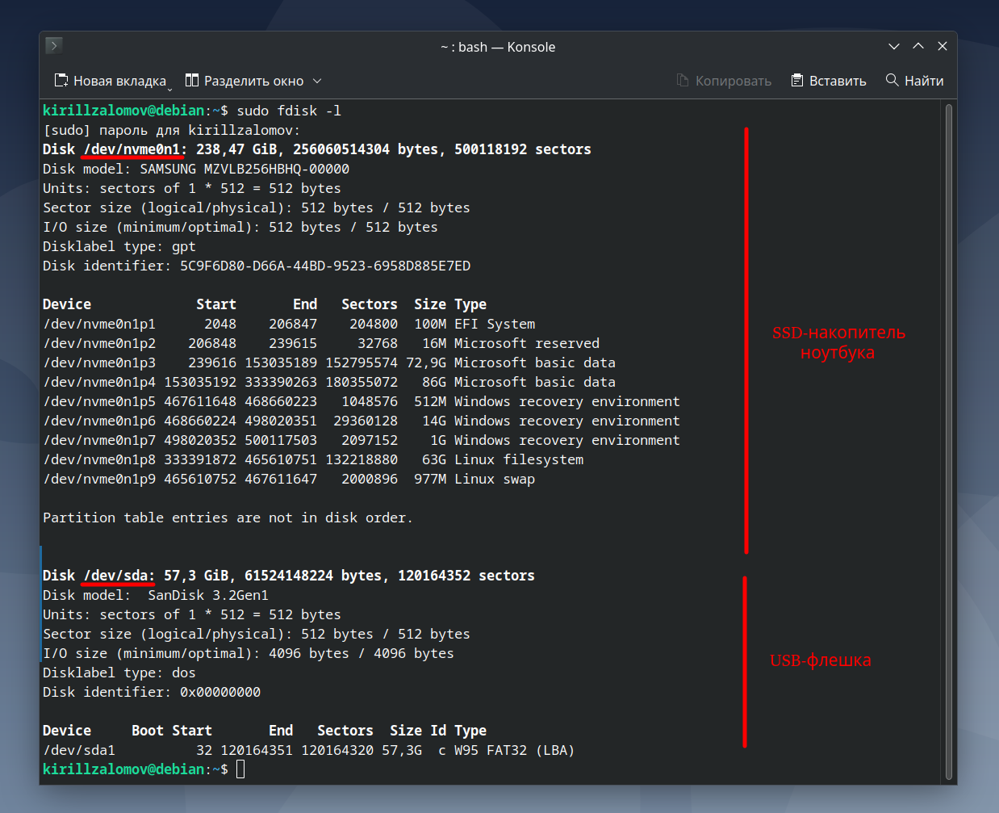
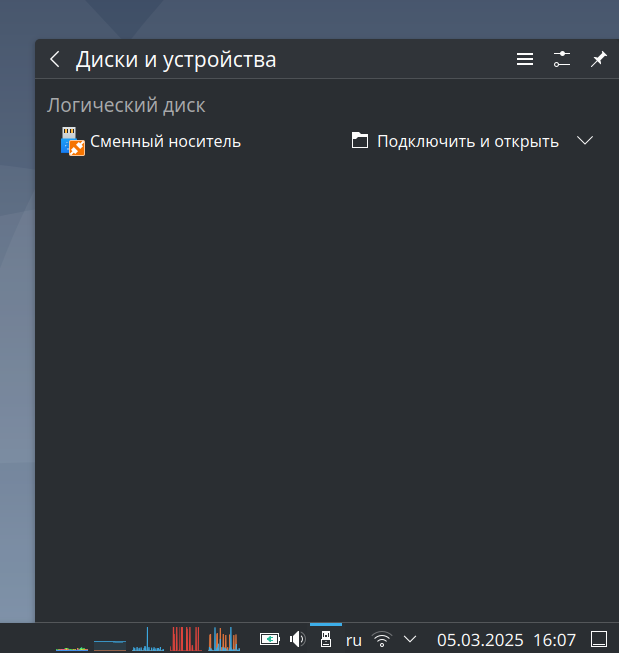
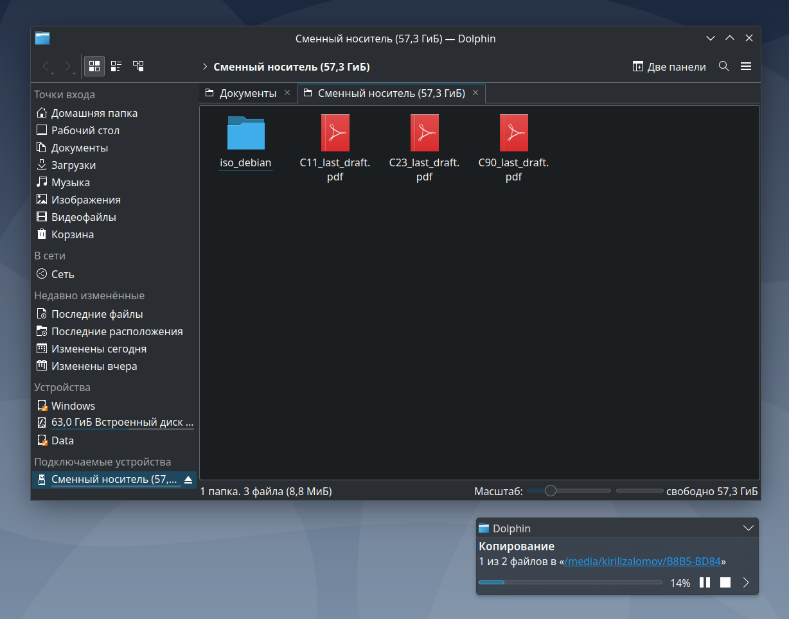

## Создание установочной флешки с ОС Debian 12 программными средствами ОС Debian  

---  

_Примечание:_ все практические примеры, приведённые в статье, выполнялись на ОС Debian 12 Bookworm.  

---  

<br>  
<br>  

## Оглавление  

1. [Поиск руководств для создания установочной USB-флешки через Debian](#chapter_1)  
2. [Скачивание на ОС Debian необходимого ПО](#chapter_2)  
3. [Скачивание необходимого iso-образа](#chapter_3)  
4. [Создание установочной флешки](#chapter_4)  
5. [Проверка работы установочной USB-флешки](#chapter_5)  
6. [Восстановление USB-флешки для хранения данных](#chapter_6)  

<br>  
<br>  

---  

<a name="chapter_1"></a>
### 1) Поиск руководств для создания установочной USB-флешки через Debian  

При создании установочной USB-флешки были использованы два источника:  

* https://wiki.debian.org/DebianInstaller/CreateUSBMedia  
* https://d-i.debian.org/manual/en.amd64/ch04s03.html  

<br>  
<br>  

---  

<a name="chapter_2"></a>
### 2) Скачивание на ОС Debian необходимого ПО  

```console
sudo apt update
sudo apt install -y wget fdisk e2fsprogs dosfstools
```

Также потребуется утилита __cp__, но поскольку она относится к пакету __coreutils__, который скачивается вместе с ОС, докачивать пакет __coreutils__ необязательно.

<br>  
<br>  

---  

<a name="chapter_3"></a>
### 3) Скачивание необходимого iso-образа  

Скачивать будем iso-образ ОС Debian.  

Для скачивания необходимого iso-образа ОС можно:  

- Воспользоваться утилитой __wget__ (при этом нужно знать URL, через который будет скачиваться образ).  
- Через браузер на странице [https://cdimage.debian.org/images/archive/](https://cdimage.debian.org/images/archive/) выбрать нужную версию ОС Debian.

В данном примере будет использован немного более сложный метод: использование утилиты __wget__. Для скачивания выбран образ: __debian-12.8.0-amd64-DVD-1.iso__ (iso-образ для offline-установки СО Debian 12.8.0).

```console
# Перейдём в папку, куда нужно скачать iso-образ:
cd ~/Документы/iso_debian/

# Скачаем выбранный iso-образ:
wget https://cdimage.debian.org/images/archive/12.8.0/amd64/iso-dvd/debian-12.8.0-amd64-DVD-1.iso
```

<br>  
<br>  

---  

<a name="chapter_4"></a>
### 4) Создание установочной флешки  

Перед созданием установочной USB-флешки следует подключить её к устройству и проверить, распознало ли её устройство (рисунок 1):  

```console
sudo fdisk -l
```

  
Рисунок 1 --- Вывод команды fdisk  

Затем необходимо определить название USB-флешки. В данном случае, как видно из рисунка 1, название USB-флешки: __/dev/sda__.

Отмонтируем флешку и проведём переразметку её разделов. Важно помнить, что у установочной флешки должен быть всего один раздел:

```console
# Отмонтируем USB-флешку /dev/sda: 
sudo umount /dev/sda

# Воспользуемся утилитой fdisk для редактирования разделов USB-флешки /dev/sda:
sudo fdisk /dev/sda

#----------------------------------------------------------------------------#
#                Действия, выполняемые внутри программы fdisk                #
#----------------------------------------------------------------------------#

# 1) Проверка существующих разделов на флешке:
Command (m for help): p
Disk /dev/sda: 57,3 GiB, 61524148224 bytes, 120164352 sectors
Disk model:  SanDisk 3.2Gen1
Units: sectors of 1 * 512 = 512 bytes
Sector size (logical/physical): 512 bytes / 512 bytes
I/O size (minimum/optimal): 4096 bytes / 4096 bytes
Disklabel type: dos
Disk identifier: 0x6c4fdb1d

Device     Boot     Start       End   Sectors  Size Id Type
/dev/sda1            2048 111775743 111773696 53,3G 83 Linux
/dev/sda2       111775744 120164351   8388608    4G 83 Linux
# В приведённом случае на флешке всего два раздела: /dev/sda1 и /dev/sda2

# 2) Удаление всех существующих разделов:
Command (m for help): d
Partition number (1,2, default 2): 1

Partition 1 has been deleted.

Command (m for help): d
Selected partition 2
Partition 2 has been deleted.

# 3) Создание раздела, занимающего весь объём флешки:
Command (m for help): n
Partition type
   p   primary (0 primary, 0 extended, 4 free)
   e   extended (container for logical partitions)
Select (default p): p
Partition number (1-4, default 1): 1
First sector (2048-120164351, default 2048): <ENTER>
Last sector, +/-sectors or +/-size{K,M,G,T,P} (2048-120164351, default 120164351): <ENTER>

Created a new partition 1 of type 'Linux' and of size 57.3 GiB.
Partition #1 contains a vfat signature.

Do you want to remove the signature? [Y]es/[N]o: y

The signature will be removed by a write command.

# 4) Проверка только что созданного и единственного раздела на флешке:
Command (m for help): p
Disk /dev/sda: 57,3 GiB, 61524148224 bytes, 120164352 sectors
Disk model:  SanDisk 3.2Gen1
Units: sectors of 1 * 512 = 512 bytes
Sector size (logical/physical): 512 bytes / 512 bytes
I/O size (minimum/optimal): 4096 bytes / 4096 bytes
Disklabel type: dos
Disk identifier: 0x6c4fdb1d

Device     Boot Start End       Sectors Size  Id Type
/dev/sda1        2048 120164352 8388608 57.3G 83 Linux
# Действительно один раздел на весь объём флешки

Filesystem/RAID signature on partition 1 will be wiped.

# 5) Запись изменений, связанных с разделами, на флешку и выход из fdisk:
Command (m for help): w
```

После того, как на флешке был создан единственный раздел, скопируем iso-образ ОС, для загрузки которой делается загрузочная USB-флешка:

```console
# Копирование iso-образа в единственный раздел флешки:
sudo cp /home/kirillzalomov/Документы/iso_debian/debian-12.8.0-amd64-DVD-1.iso /dev/sda

# Гарантированный сброс данных из буфера файловой системы на флешку:
sync
```

<br>  
<br>  

---  

<a name="chapter_5"></a>
### 5) Проверка работы установочной USB-флешки  

Подключим флешку к ноутбуку (HUAWEI MateBook D15) и включим его. При включении ноутбука периодически будем нажимать клавишу F2, пока не будет выполнен вход в UEFI. Через UEFI определим, является ли флешка установочной. Как видно из рисунка 2, флешка определяется как загрузочный носитель:  

  
Рисунок 2 --- Обнаружение флешка, как загрузочного носителя  

<br>  
<br>  

---  

<a name="chapter_6"></a>
### 6) Восстановление USB-флешки для хранения данных  

Сделаем так, чтобы флешка перестала быть установочной, и подходила для хранения данных. Для этого точно так же, как и в пункте 3, будем использовать утилиты __fdisk__ и __mkfs__.

Вставим флешку в ноутбук без монтирования и выполним следующие команды:  

```console
kirillzalomov@debian:~$ sudo fdisk -l
[sudo] пароль для kirillzalomov: 
Disk /dev/nvme0n1: 238,47 GiB, 256060514304 bytes, 500118192 sectors
Disk model: SAMSUNG MZVLB256HBHQ-00000              
Units: sectors of 1 * 512 = 512 bytes
Sector size (logical/physical): 512 bytes / 512 bytes
I/O size (minimum/optimal): 512 bytes / 512 bytes
Disklabel type: gpt
Disk identifier: 5C9F6D80-D66A-44BD-9523-6958D885E7ED

Device             Start       End   Sectors  Size Type
/dev/nvme0n1p1      2048    206847    204800  100M EFI System
/dev/nvme0n1p2    206848    239615     32768   16M Microsoft reserved
/dev/nvme0n1p3    239616 153035189 152795574 72,9G Microsoft basic data
/dev/nvme0n1p4 153035192 333390263 180355072   86G Microsoft basic data
/dev/nvme0n1p5 467611648 468660223   1048576  512M Windows recovery environment
/dev/nvme0n1p6 468660224 498020351  29360128   14G Windows recovery environment
/dev/nvme0n1p7 498020352 500117503   2097152    1G Windows recovery environment
/dev/nvme0n1p8 333391872 465610751 132218880   63G Linux filesystem
/dev/nvme0n1p9 465610752 467611647   2000896  977M Linux swap

Partition table entries are not in disk order.


Disk /dev/sda: 57,3 GiB, 61524148224 bytes, 120164352 sectors
Disk model:  SanDisk 3.2Gen1
Units: sectors of 1 * 512 = 512 bytes
Sector size (logical/physical): 512 bytes / 512 bytes
I/O size (minimum/optimal): 4096 bytes / 4096 bytes
Disklabel type: dos
Disk identifier: 0x789476d3

Device     Boot Start     End Sectors  Size Id Type
/dev/sda1  *        0 7808607 7808608  3,7G  0 Empty
/dev/sda2       22504   41543   19040  9,3M ef EFI (FAT-12/16/32)
kirillzalomov@debian:~$ sudo fdisk /dev/sda

Welcome to fdisk (util-linux 2.38.1).
Changes will remain in memory only, until you decide to write them.
Be careful before using the write command.

The device contains 'iso9660' signature and it will be removed by a write command. See fdisk(8) man page and --wipe option for more details.

# 1) Удаление всех существующих разделов на флешке
Command (m for help): d
Partition number (1,2, default 2): 1

Partition 1 has been deleted.

Command (m for help): d
Selected partition 2
Partition 2 has been deleted.

# 2) Создание нового раздела под хранение данных
Command (m for help): n
Partition type
   p   primary (0 primary, 0 extended, 4 free)
   e   extended (container for logical partitions)
Select (default p): p
Partition number (1-4, default 1): 1
First sector (2048-120164351, default 2048): 2048
Last sector, +/-sectors or +/-size{K,M,G,T,P} (2048-120164351, default 120164351): 120164351

Created a new partition 1 of type 'Linux' and of size 57,3 GiB.

# 3) Запись изменений на флешку
Command (m for help): w
The partition table has been altered.
Calling ioctl() to re-read partition table.
Syncing disks.

# 4) Проверка изменений в разделах флешки
kirillzalomov@debian:~$ sudo fdisk -l
Disk /dev/nvme0n1: 238,47 GiB, 256060514304 bytes, 500118192 sectors
Disk model: SAMSUNG MZVLB256HBHQ-00000              
Units: sectors of 1 * 512 = 512 bytes
Sector size (logical/physical): 512 bytes / 512 bytes
I/O size (minimum/optimal): 512 bytes / 512 bytes
Disklabel type: gpt
Disk identifier: 5C9F6D80-D66A-44BD-9523-6958D885E7ED

Device             Start       End   Sectors  Size Type
/dev/nvme0n1p1      2048    206847    204800  100M EFI System
/dev/nvme0n1p2    206848    239615     32768   16M Microsoft reserved
/dev/nvme0n1p3    239616 153035189 152795574 72,9G Microsoft basic data
/dev/nvme0n1p4 153035192 333390263 180355072   86G Microsoft basic data
/dev/nvme0n1p5 467611648 468660223   1048576  512M Windows recovery environment
/dev/nvme0n1p6 468660224 498020351  29360128   14G Windows recovery environment
/dev/nvme0n1p7 498020352 500117503   2097152    1G Windows recovery environment
/dev/nvme0n1p8 333391872 465610751 132218880   63G Linux filesystem
/dev/nvme0n1p9 465610752 467611647   2000896  977M Linux swap

Partition table entries are not in disk order.


Disk /dev/sda: 57,3 GiB, 61524148224 bytes, 120164352 sectors
Disk model:  SanDisk 3.2Gen1
Units: sectors of 1 * 512 = 512 bytes
Sector size (logical/physical): 512 bytes / 512 bytes
I/O size (minimum/optimal): 4096 bytes / 4096 bytes
Disklabel type: dos
Disk identifier: 0x789476d3

Device     Boot Start       End   Sectors  Size Id Type
/dev/sda1        2048 120164351 120162304 57,3G 83 Linux

# 5) Создание файловой системы FAT на новом и единственном разделе флешки
kirillzalomov@debian:~$ sudo mkfs.vfat /dev/sda1
mkfs.fat 4.2 (2021-01-31)
```

После выполнения данных операций флешка будет доступна для монтирования и сохранения в неё данных (рисунок 3 и 4):  

  
Рисунок 3 --- Доступность флешки для монтирования  

  
Рисунок 4 --- Сохранение на флешку файлов  

<br>  
<br>  

---  