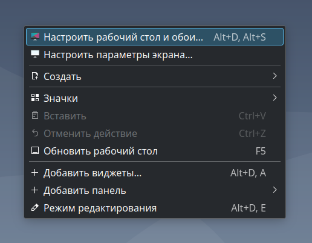
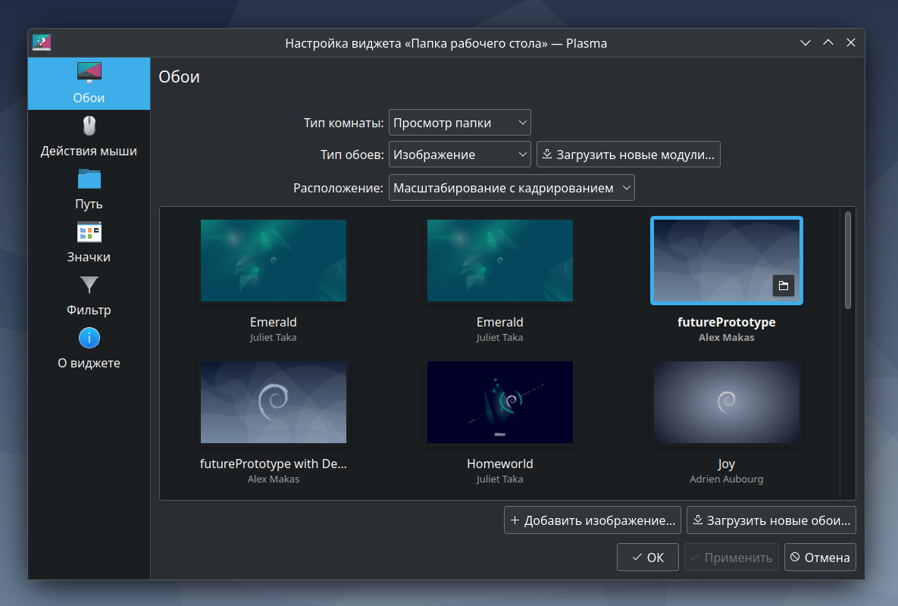

## Смена обоев рабочего стола и экрана блокировки в Debian  

---  

_Примечание:_ все практические примеры, приведённые в статье, выполнялись на ОС Debian 12 Bookworm.  

---  

<br>  
<br>  

## Оглавление  

1. [Смена обоев рабочего стола в KDE Plasma](#chapter_1)  
2. [Смена обоев экрана блокировки в KDE Plasma](#chapter_2)  

<br>  
<br>  

---  

<a name="chapter_1"></a>
### 1) Смена обоев рабочего стола в KDE Plasma  

Способы смены изображения рабочего стола:  

1. Через настройки с графическим интерфейсом:  

Для этого нужно нажать ПКМ по любой свободной области рабочего стола и затем выбрать пункт "Настроить рабочий стол и обои" (рисунок 1).  

После этого откроется окно с выбором изображения для рабочего стола (рисунок 2).  

  
Рисунок 1 --- Пункт "Настроить рабочий стол и обои" контекстного меню рабочего стола  

  
Рисунок 2 --- Окно выбора изображения для рабочего стола  

2. Через терминал:  

```console
plasma-apply-wallpaperimage <path_to_image>
# Изображение можно указать в виде форматов: jpg, png, svg
```

<br>  
<br>  

---  

<a name="chapter_2"></a>
### 2) Смена обоев экрана блокировки в KDE Plasma  

В отличие от смены обоев рабочего стола, здесь доступен только способ через терминал:  

```console
kwriteconfig5 --file kscreenlockerrc --group Greeter --group Wallpaper --group org.kde.image --group General --key Image <path_to_image>
# Изображение можно указать в виде форматов: jpg, png, svg
```

<br>  
<br>  

---  
